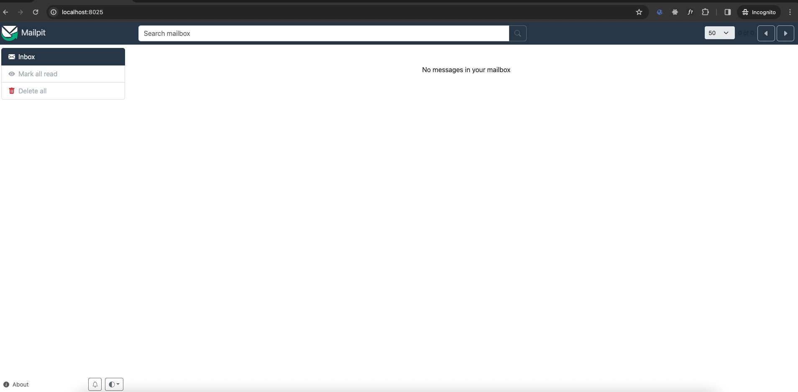

## Project Setup Instructions

This project has been built with Laravel 10.47.0. To set up this project, you must first have Docker installed, as this project is run using Laravel Sail (Docker).

### Prerequisites

Before beginning the setup, ensure you have the following installed:

- Docker
- Composer (needed to install all packages with Composer)

### Out-of-the-Box Setup

The following technologies are used out of the box with this setup:

- PHP 8.3
- MySQL 8.0
- Redis
- MailPit

### Installation Steps

1. **Clone & Install Dependencies**
   Clone the repository

    ```bash
    git clone git@github.com:samushi/event-assignment.git
    ```
   Switch to the repo folder

    ```bash
   cd event-assignment
   ```
   Copy env file from example
   ```bash
   cp .env.example .env
    ```
   Install all the dependencies using composer

   ```bash
   composer install 
   ```

2. **Start the Project with Laravel Sail**

   After installing the project with the above command, you can proceed to start Laravel Sail:
    ```bash
    ./vendor/bin/sail up -d
    ```
   To stop the server:
    ```bash
    ./vendor/bin/sail down
   ```
   Note: This command is used only the first time to set up the project.


3. **Database Migration and Seeding**

   Once the server starts with Laravel Sail, we need to migrate the database and seed the initial data:
    ```bash 
     ./vendor/bin/sail artisan assignment:setup 
    ```

You can now access the server at http://localhost:80 also to the api http://localhost:80/api/


## After Setup

Once the setup is completed and the project is running, the database will contain some fake users for testing purposes. Additionally, there is a static user that we can use to test the API:

- **Email:** samimaxhuni@example.com
- **Password:** Kosova123

### Postman Collection

For easy access to all endpoints via Postman, a Postman collection is available. You can access it by clicking on the following link:

[Download Postman Collection](https://github.com/samushi/event-assignment/raw/main/postman_collection.json)

## Application Architecture
This application is built following the principles of Domain-Driven Design (DDD) and leverages clean, maintainable code practices to ensure robustness and scalability.

### Project Structure Overview
The project is organized into several key directories, as is typical with Laravel applications, including:
- app/
- bootstrap/
- config/
- Other standard Laravel directories

However, the focus of this section is the `app/` directory, which is structured to adhere to DDD principles. Here's an overview of the DDD structure within the `app/` directory:
```
app/
├── App/
├── Domain/
│   ├── Auth/
│   ├── Event/
│   └── Weather/
└── Support/
```
### Directory Breakdown
- App/: Contains Laravel-specific classes, including handlers, exceptions, and other framework essentials.
- Domain/: This is where the core modules of the product are located, reflecting the business logic and capabilities of the application, such as authentication, events management, and weather services. The Domain directory is further divided into subdirectories, each representing a distinct domain or module within the application:
  - `Auth/` for authentication mechanisms
  - `Event/` for event management functionality
  - `Weather/` for weather-related services
- Support/: Houses auxiliary functionalities that support the application but do not fit within the core domains, such as utility classes and helpers.
  This structure not only promotes a clean separation of concerns but also enhances the maintainability and scalability of the application by encapsulating business logic within clearly defined boundaries.

This structure not only promotes a clean separation of concerns but also enhances the maintainability and scalability of the application by encapsulating business logic within clearly defined boundaries.

## Accessing SMTP Testing Emails with MailPit
To review the emails sent during testing, you can access the MailPit web interface via the following URL:
```text
http://localhost:8025
```
This interface allows you to view and debug all emails sent by the application during development and testing phases, ensuring that your email functionality works as expected.



## Accessing Laravel Horizon
For monitoring and managing Laravel queues, Laravel Horizon can be accessed through the following URL:
```text
http://localhost:80/horizon
```
Laravel Horizon provides a beautiful dashboard for Laravel Redis queues, offering real-time insights into job processing, failures, and throughput.

## Api Specification

### API Reference

Here, we are going to implement REST API with Passport authentication.

### What is Passport?
Laravel makes API authentication a breeze using Laravel Passport. APIs typically use tokens to authenticate users and do not maintain session state between requests. you can use passport for user authentication for api's.

#### Register

```http
  POST /api/register
```

| Parameter | Type     | Description                |
| :-------- | :------- | :------------------------- |
| `first_name` | `string` | **Required** |
| `last_name` | `string` | **Required** |
| `email` | `string` | **Required** email |
| `password` | `string` | **Required** |
| `password_confirmation` | `string` | **Required** need to be same with password|

#### Login

```http
  POST /api/login
```

| Parameter | Type     | Description                |
| :-------- | :------- | :------------------------- |
| `email` | `string` | **Required** |
| `password` | `string` | **Required** |


All endpoints in this API require Bearer token authorization except (login, register). To authorize, include your token in the Authorization header of each request as follows:

#### Headers

| Header | Value     |
| :-------- | :------- | 
| `Authorization` | `Bearer {api_key}` | 

**Note:** Replace `{api_key}` with your actual API key.


### Create Event

```http
    POST {{api_url}}event/create
```

| Parameter    | Type     | Description                       |
|--------------|----------|-----------------------------------|
| `title`      | `string` | **Required**. The title of the event |
| `event_date` | `string` | **Required**. The date and time of the event (e.g., "2024-05-10 15:00") |
| `location`   | `string` | **Required**. The location of the event |
| `description`| `string` | **Required**. A description of the event |
| `invitees`   | `array`  | **Required**. An array of invitee email addresses |

### List events by date interval

```http
    GET {{api_url}}event/interval
```
| Parameter  | Type     | Description                         |
|------------|----------|-------------------------------------|
| `start`    | `string` | **Required**. Start date for the interval (e.g., "2024-05-01") |
| `end`      | `string` | **Required**. End date for the interval (e.g., "2024-07-01") |
| `per_page` | `number` | **Required**. Number of results per page |

### List events grouped by location by date interval

```http
    GET {{api_url}}event/location
```

| Parameter  | Type     | Description                         |
|------------|----------|-------------------------------------|
| `start`    | `string` | **Required**. Start date for the interval (e.g., "2024-05-01") |
| `end`      | `string` | **Required**. End date for the interval (e.g., "2024-07-01") |
| `per_page` | `number` | **Required**. Number of results per page |

### Get Event

```http
    GET {{api_url}}event/{event_id}
```
No body parameters required for this endpoint.

### Delete Event

```http
    DELETE {{api_url}}event/{event_id}
```
No body parameters required for this endpoint.

### Update Event

```http
    GET {{api_url}}event/{event_id}
```

| Parameter    | Type     | Description                      |
|--------------|----------|----------------------------------|
| `title`      | `string` | **Optional**. The title of the event |
| `event_date` | `string` | **Optional**. The date and time of the event |
| `location`   | `string` | **Optional**. The location of the event |
| `description`| `string` | **Optional**. A description of the event |
| `invitees`   | `array`  | **Optional**. An array of invitee email addresses |


### Testing
For testing the application, Laravel Pest is utilized. Pest is a testing framework for PHP, built with a focus on simplicity and elegance. It provides an intuitive testing experience and is fully compatible with Laravel. Pest makes it easy to write expressive tests in PHP.

To run your tests using Laravel Pest, use the following command:

```Bash
./vendor/bin/sail pest
```
This command runs all your Pest tests, providing you with detailed output on your test results. Pest supports a wide range of testing features, including unit tests, feature tests, and higher-level tests, making it a versatile tool for ensuring your application behaves as expected.
### Conclusion

This README provides all the necessary steps to get your Laravel project up and running, including how to use Docker and Laravel Sail for the setup, how to install dependencies with Composer, and how to migrate and seed your database. With the static user provided, you can immediately start testing your API using the provided Postman collection.
